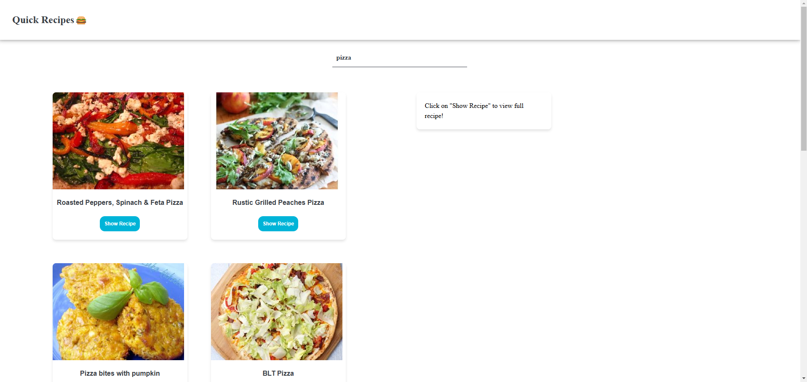
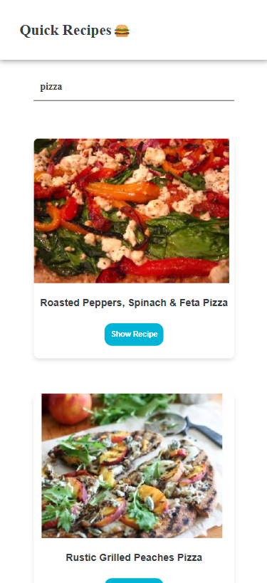
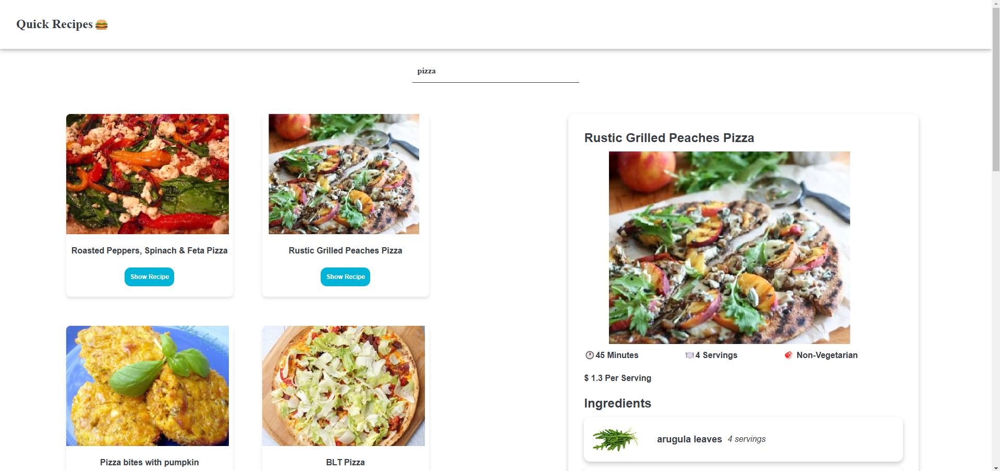
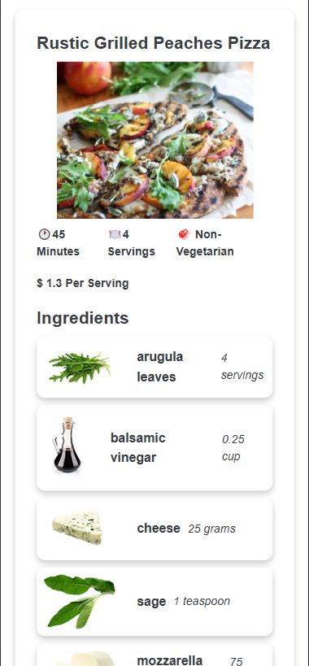

# Quick Recipes

Quick Recipes is a React-based web application that allows users to search for recipes and view detailed information about each recipe, including ingredients and instructions. The application uses the Spoonacular API to fetch recipe data and displays it in a user-friendly interface.

## Features

- Search for recipes by keyword
- View detailed information about each recipe, including ingredients and instructions
- Responsive design for all screen sizes
- Persistent state using local storage

## Setup and Installation

### Prerequisites

- Node.js (version 14 or higher)
- npm (version 6 or higher)

### Installation

1. Clone the repository:

   ```bash
   git clone https://github.com/your-username/quick-recipes.git
   cd quick-recipes

   ```

2. Install the dependencies:

   `npm install`

3. Create a .env file in the root directory and add your Spoonacular API key:

```
   VITE_URL=https://api.spoonacular.com/recipes
   VITE_API_KEY=your_api_key_here
```

### Running the Application

1. Start the development server:
   `npm run dev`

2. Open your browser and navigate to http://localhost:5173 to view the application.
   
## Screenshots





### Project Structure

```
└──src/
   └──components/
         ├──Footer.jsx
         ├──FoodItem.jsx
         ├──FoodList.jsx
         ├──IngredientList.jsx
         ├──InnerContainer.jsx
         ├──Nav.jsx
         ├──Recipe.jsx
         ├──RecipeContainer.jsx
         └──Search.jsx
   │  ├──index.css
   │  └──main.jsx
   ├──.gitignore
   ├──package.json
   └──vite.config.js
```
